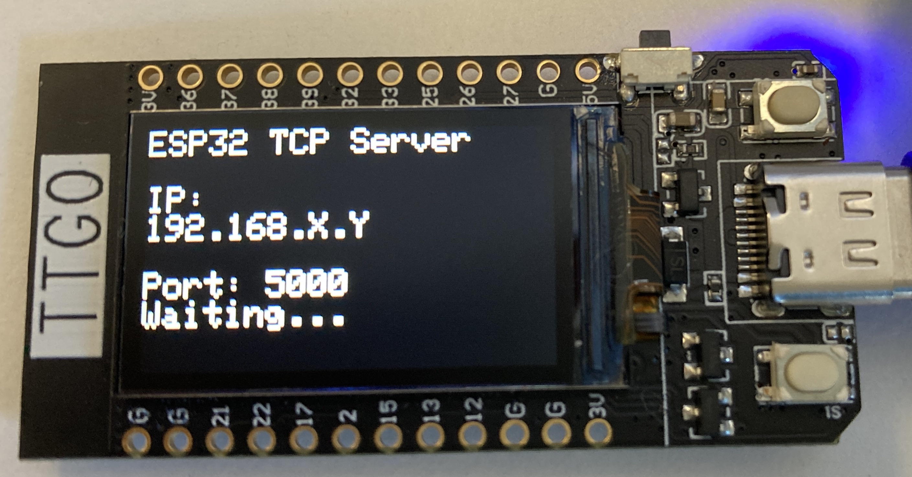

# WifiParMarker

### Overview

The primary objective of this repository is to enable wireless data exchange between devices. Once the system is set up, the TTGO T-Display board automatically connects to the **iotroam** network and displays its assigned IP address on the LCD screen.

> [!IMPORTANT]
> Ensure that both TTGO T-Display board and the Server are configured with the same password to connect to the **iotroam** network.

After a TCP client establishes a connection, the board can send and receive data over the TCP protocol, enabling bidirectional communication and supporting WebSocket-based messaging.

---

### Getting Started

1. Upload the source code located in the `TCPServer` folder to the TTGO T-Display board.  
   Ensure that the correct **iotroam** network password is set in the main sketch.
2. Power on the board and note the IP address displayed on the LCD screen.
3. Enter the displayed IP address into the Python script in `TCPClient` folder.
4. Run the Python script from the terminal.
5. If everything works fine, you can see the sent message displayed on the TTGO board.

### To Be Tested

- [ ] Verify if there is any data loss during continuous data transfer.
- [ ] Confirm stable TCP connection under prolonged operation.
- [ ] What happens when multiple clients try to talk to the Server board?
- [ ] Measure latency between client and server.

> For more information about using GitHub, see the [SOLO GitHub User Guide](https://solo-fsw-projects.github.io/).
